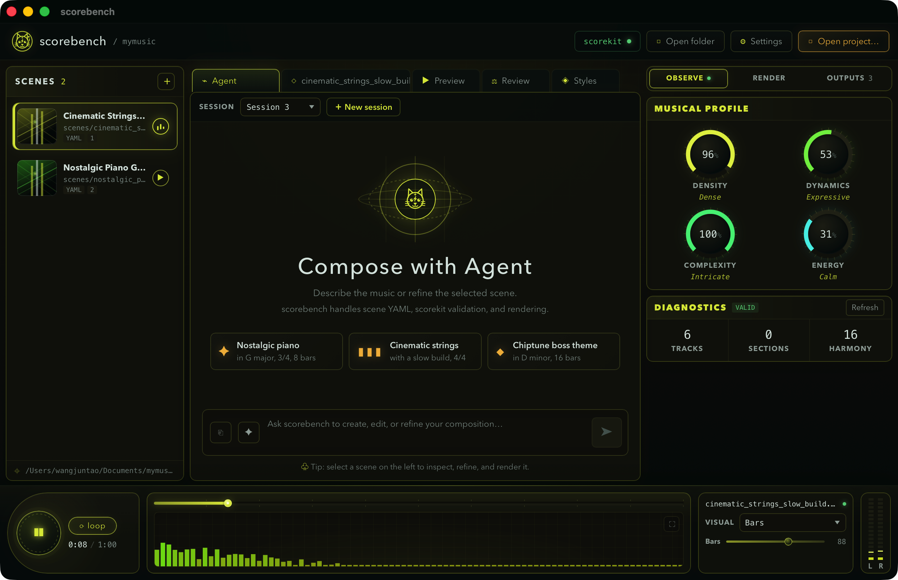

# scorebench

[](https://github.com/talkincode/scorebench/actions/workflows/ci.yml)
[](https://github.com/talkincode/scorebench/actions/workflows/pages.yml)

> **Agent-native workbench for [scorekit](https://github.com/talkincode/scorekit).**
> You talk to the agent; the agent writes the scene DSL and drives scorekit. An explicit raw-YAML editor remains available for manual work.



scorebench is a desktop app (Tauri 2 + Svelte 5) that hosts a minimal ReACT agent for composing and rendering game music with scorekit. It is the *shell*, scorekit is the *compiler*, the LLM is the *composer*.

```text
you ──chat──► agent core (Rust, OpenAI Responses API only)
                 │  tool calls (subprocess, --json)
                 ▼
              scorekit  validate / lint / build / diff
                 │
                 ▼
              project dir ──► scene.yaml + out/*.ogg + meta.json
                 │
                 ▼
              WebAudio playback + spectrum (AnalyserNode, zero in-house DSP)
```

## Product shape

- **One project per window.** Opening scorebench means opening one project directory (scene YAML + rendered assets + agent memory). No multi-project tabs.
- **Agent-first authoring.** The agent is the primary scene writer. Experienced users can also use the raw-source editor with explicit Validate and Save actions; there is no autosave. Parameter panels remain read-only observations.
- **Playback & spectrum in the webview.** Decoding, FFT, and progress come from the browser's WebAudio API (`AnalyserNode`) — no Rust audio stack, no in-house DSP.
- **Project memory.** The agent maintains a rolling project summary; when the conversation exceeds the configured context budget it compacts automatically.

## Iron rules

1. **Agent core stays minimal.** One provider spec: the OpenAI Responses API (any compatible endpoint via base URL + key). No multi-provider abstraction, no agent framework, no SDK.
2. **scorebench never renders audio itself.** All compilation/rendering/export goes through the `scorekit` CLI (`--json`). If scorekit can't do it, scorebench doesn't do it.
3. **No structured editing UI.** No piano roll, timeline, or form-based scene editor. The only manual in-app write path is the explicit raw-YAML editor; scorebench otherwise observes and plays.
4. **Deterministic boundary respected.** scorebench never post-processes rendered artifacts; what scorekit writes is what plays.

## Status

Core milestones M0–M5 complete (walking skeleton → agent core → observation surfaces → project memory → spectrum modules → release engineering). See [docs/roadmap.md](docs/roadmap.md).

## Install (Users)

### macOS (Homebrew, recommended)

```bash
brew tap talkincode/tap
brew trust --tap talkincode/tap
brew install --cask talkincode/tap/scorebench
scorekit doctor
```

`talkincode/tap/scorebench` declares `talkincode/tap/scorekit` as a dependency, so Homebrew installs ScoreKit for you.

If Homebrew says Xcode is too old even though a newer Xcode or Xcode beta is already installed, point `xcode-select` at the active developer directory before retrying:

```bash
sudo xcode-select -s /Applications/Xcode-beta.app/Contents/Developer
xcodebuild -version
brew install --cask talkincode/tap/scorebench
```

### Linux and Windows

Install scorebench from [Releases](https://github.com/talkincode/scorebench/releases):

- Linux: use the `.deb` or `.AppImage` artifact.
- Windows: use the `.msi` or `-setup.exe` artifact.

Install ScoreKit separately (for example with Homebrew `brew install talkincode/tap/scorekit`, or from [ScoreKit Releases](https://github.com/talkincode/scorekit/releases)), then confirm:

```bash
brew trust --tap talkincode/tap   # when installing ScoreKit via Homebrew tap
scorekit --version
scorekit doctor
```

If scorebench starts but cannot find ScoreKit, set `SCOREBENCH_SCOREKIT` to the absolute path of the ScoreKit executable and restart the app.

## Development (Contributors)

```bash
npm install
npm run tauri dev    # requires Rust toolchain + scorekit on PATH
```

## Documentation

The English user guide covers the ScoreKit scene protocol, practical
arrangement concepts, render backends, sound-source provenance, licensing,
and troubleshooting. Read it on
[GitHub Pages](https://talkincode.github.io/scorebench/) or from
[`docs-site/src`](docs-site/src/).

Build the site locally with mdBook 0.5.3 or newer:

```bash
mdbook build docs-site
mdbook serve docs-site --open
```

The API endpoint, model, context budget, and API key are configured from the in-app **Settings** panel. Keys use the OS keychain; the explicit insecure fallback is stored only in the Tauri app-config directory with mode `0600`.

## Version and release

`src-tauri/tauri.conf.json` is the application-version source of truth:

```bash
npm run version:set -- 0.1.1
git commit -am "Release 0.1.1"
git tag v0.1.1
git push origin main v0.1.1
```

Version tags build macOS (`aarch64` and `x86_64`), Windows, and Linux installers, generate `SHA256SUMS`, and assemble a draft GitHub release. Publishing that release updates the Homebrew cask in `talkincode/homebrew-tap` when `HOMEBREW_TAP_TOKEN` is configured. Apple signing/notarization activates when its repository secrets are present; local and non-macOS builds do not require those secrets. scorekit is discovered at runtime and is installed as a Homebrew cask dependency, but is not bundled.

## License

The source code is licensed under the [MIT License](LICENSE).

Project names, logos, the cat emblem, application icons, and other brand
assets are excluded from that license. The "talkincode" name and the cat
emblem are reserved brand assets; see [TRADEMARKS.md](TRADEMARKS.md).
